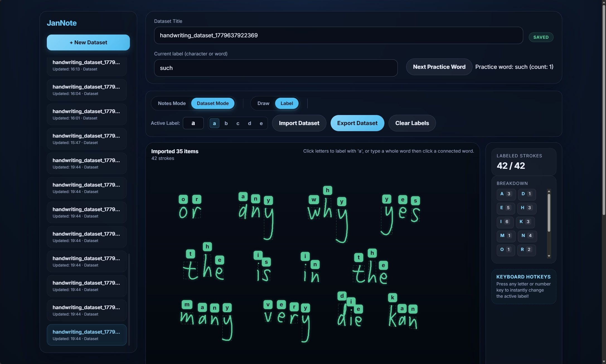

# JanNote



**Ink Replay & Handwriting Recognition Prototype**

An interactive, stylus-friendly web application for stroke-based drawing, ink replay, dataset collection, and personalized
handwriting recognition. The application now includes both a character model and a connected-cursive sequence model.

---

## Running the Application

1. **Install dependencies**:

    ```bash
    npm install
    ```

    ```bash
    pip install tensorflow
    ```

2. **Start the local server**:

    ```bash
    node server.js
    ```

3. Open your browser and navigate to `http://localhost:3000`.

---

## 1. Project Evolution

This project has evolved from a simple drawing canvas into a complete self-contained handwriting recognition and note-taking
ecosystem:

- **Phase 1: Draw & Replay (Initial Prototype)**
    - Basic HTML5 canvas capturing raw pen strokes.
    - Sequential playback controls with adjustable speed and writing-speed statistics (CPM/WPM).
- **Phase 2: Dataset Collection & Exporting**
    - Added **Label Mode** to assign ground-truth characters to drawn strokes.
    - Integrated **Dataset Exporting** to download drawing sessions as JSON datasets.
    - Added **Periodic Autosave Sync** so labeled samples are pushed back to the server automatically.
- **Phase 3: Deep Learning & Auto-Predict**
    - Built a **TensorFlow LSTM classifier** (`train.py`) and a Node-spawned **Python Inference Bridge** (`predict.py`) for live,
      on-the-fly character classification.
    - Added velocity and time delta features (`delta_time`, `vx`, `vy`) to boost classification accuracy.
    - Implemented dynamic bounding boxes and color-coded prediction badges (blue for predictions, green for ground-truth labels).
- **Phase 4: Dataset Importing & Quick Writing**
    - Implemented **Dataset Importing** to reload JSON datasets.
    - Resolved temporal overlaps on import via sequential timeline shifting (adding `1000ms` between letters).
    - Added **Sequential Background Predictions** for imported unlabeled characters.
    - Introduced **Adaptive Finalization Timing** for faster print writing without long forced pauses.
- **Phase 5: Word Grouping & Spelling Checker**
    - Implemented adaptive spacing to group finalized characters into words.
    - Loaded `seamless_words.txt` client-side to check spelling.
    - Added a **Recognized Text box** with typo highlighting and a detailed breakdown panel.
- **Phase 6: Connected Cursive Word Recognition**
    - Added **Continuous Script mode** with explicit **Commit Word** workflow.
    - Added support for sequence-level dataset samples (`sequenceSamples`) for connected words.
    - Added a second inference route (`/predict-sequence`) for sequence recognition.
    - Added **CTC sequence model training** and vocabulary export.
    - Added **visual boundary markers** for predicted letter spans over committed words.
    - Added **Next Practice Word** prompts to speed up connected-word data collection.

---

## 2. How the Handwriting ML Model Works

Unlike traditional image-based OCR models (which process static pixel grids), this prototype uses **Sequence-Based (Online)
Recognition**. It processes the drawing as a time-series sequence of pen movements.

For every captured point, the model receives a 6-dimensional feature vector:

`[x, y, pen_lift, delta_time, vx, vy]`

### Feature Breakdown:

1. **`x, y` coordinates**: Position values normalized to fit inside a unified `256 x 256` bounding box.
2. **`pen_lift`**: A binary marker (`0.0` or `1.0`) signaling stroke boundaries.
3. **`delta_time`**: Time elapsed (seconds) between the current point and previous point.
4. **`vx, vy`**: Horizontal and vertical velocity, helping the model capture writing rhythm and direction.

### Two-Model Architecture:

- **Character Model (`/predict`)**
    - Sequence length: `128`
    - Trained from dataset field: `samples`
    - Output files: `handwriting_model.keras`, `class_names.json`
- **Sequence CTC Model (`/predict-sequence`)**
    - Sequence length: `192`
    - Trained from dataset field: `sequenceSamples`
    - Output files: `handwriting_sequence_model.keras`, `sequence_vocab.json`
    - Returns text plus approximate `letterSpans` for boundary visualization

---

## 3. Current Workflow

### Print Letters

- Keep **Continuous Script** off.
- Draw isolated letters.
- Let auto-predict classify per letter.
- Use Label Mode for corrections.

### Connected Cursive Words

- Turn **Continuous Script** on.
- Write one connected word.
- Click **Commit Word**.
- Use **Auto-Predict** for immediate sequence inference.
- Use **Next Practice Word** for rapid training data collection.

---

## 4. Project TODO Checklist

### Completed Features

- [x] **Stroke Recording & Replay**: Animate drawn strokes sequentially with speed controls.
- [x] **Labeling Mode**: Set active labels and relabel strokes/groups directly on canvas.
- [x] **JSON Export**: Compile active strokes and finalized groups into a dataset.
- [x] **JSON Import**: Load exported datasets back into the application.
- [x] **Fast Writing Support**: Adaptive finalization for print writing.
- [x] **Character LSTM Trainer & Predictor**: Sequence padding (128), `/predict` API.
- [x] **Sequence CTC Trainer & Predictor**: Sequence padding (192), `/predict-sequence` API.
- [x] **Velocity/Temporal Features**: Combined spatial and temporal inputs (`delta_time`, `vx`, `vy`).
- [x] **Connected Cursive Mode**: Commit connected words and train on full-word labels.
- [x] **Letter Boundary Markers**: Visualized predicted span boundaries for committed words.
- [x] **Practice Prompt Helper**: Suggested easy connected words to accelerate data collection.

### Future Goals

- [ ] **Interactive Correction**: Allow direct editing of reconstructed text and round-trip correction into labels.
- [ ] **Sequence Confidence Calibration**: Improve confidence quality for low-data sequence models.
- [ ] **Model Evaluation Dashboard**: Add held-out validation metrics and confusion analysis in-app.
- [ ] **Cloud Syncing**: Sync saved and labeled handwriting JSON files with external storage.
- [ ] **Expanded Character Set**: Improve support for uppercase letters, digits, and punctuation.

---

If you want to train the model with your own data, export your datasets and run:

```bash
python train.py
```
