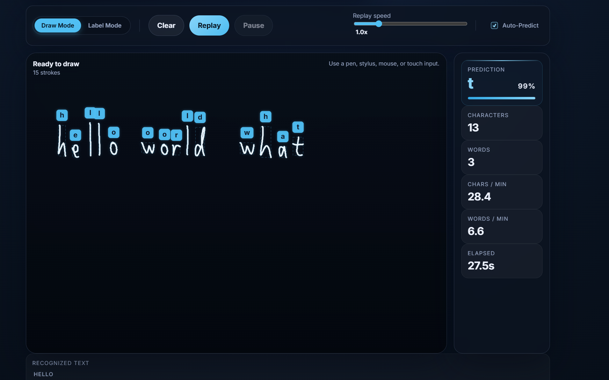

# JanNote



**Ink Replay & Handwriting Recognition Prototype**

An interactive, stylus-friendly web application for stroke-based drawing, ink replay, dataset collection, and personalized
handwriting recognition. The application features a client-side canvas, a TensorFlow-backed LSTM classification model, and a live
dictionary spellcheck system.

---

## Running the Application

1. **Install dependencies**:

    ```bash
    npm install
    ```

    ```bash
    pip install tensorflow
    ```

2. **Start the local server**:

    ```bash
    node server.js
    ```

3. Open your browser and navigate to `http://localhost:3000`.

---

## 1. Project Evolution

This project has evolved from a simple drawing canvas into a complete self-contained handwriting recognition and note-taking
ecosystem:

- **Phase 1: Draw & Replay (Initial Prototype)**
    - Basic HTML5 canvas capturing raw pen strokes.
    - Sequential playback controls with adjustable speed and writing-speed statistics (CPM/WPM).
- **Phase 2: Dataset Collection & Exporting**
    - Added **Label Mode** to assign ground-truth characters to drawn strokes.
    - Integrated **Dataset Exporting** to download drawing sessions as JSON datasets.
- **Phase 3: Deep Learning & Auto-Predict**
    - Built a **TensorFlow LSTM classifier** (`train.py`) and a Node-spawned **Python Inference Bridge** (`predict.py`) for live,
      on-the-fly character classification.
    - Added velocity and time delta features ($\Delta t$, $v_x$, $v_y$) to boost classification accuracy.
    - Implemented dynamic bounding boxes and color-coded prediction badges (blue for predictions, green for ground-truth labels).
- **Phase 4: Dataset Importing & Quick Writing**
    - Implemented **Dataset Importing** to reload JSON datasets.
    - Resolved temporal overlaps on import via sequential timeline shifting (adding `1000ms` between letters).
    - Added **Sequential Background Predictions** for imported unlabeled characters.
    - Introduced **Hybrid Spatial-Temporal Finalization Boundaries** in `startStroke()` to allow quick writing by immediately
      finalizing characters when horizontal gaps or carriage returns are detected.
- **Phase 5: Word Grouping & Spelling Checker**
    - Implemented adaptive spacing to group finalized characters into words.
    - Loaded a 10k English dictionary (`dictionary.txt`) client-side to check spelling.
    - Added a **Recognized Text box** with red wavy underlines for typos and a detailed breakdown sidebar showing verification
      checkmarks.

---

## 2. How the Handwriting ML Model Works

Unlike traditional image-based OCR models (which process grids of static pixels), this prototype uses **Sequence-Based (Online)
Recognition**. It processes the drawing as a time-series sequence of cursor/stylus movements:

$$X = [p_1, p_2, p_3, \dots, p_N]$$

For every captured point $p_i$, the model receives a 6-dimensional feature vector:

$$p_i = [x_i, y_i, \text{pen\_lift}_i, \Delta t_i, v_{xi}, v_{yi}]$$

### Feature Breakdown:

1. **$x, y$ coordinates**: Position values normalized to fit inside a unified $256 \times 256$ bounding box.
2. **$\text{pen\_lift}$**: A binary marker ($0.0$ or $1.0$). Set to $1.0$ only when the stylus or mouse is lifted, signaling the
   end of an individual stroke (allowing multi-stroke letters like `t` or `x`).
3. **$\Delta t$ (Delta Time)**: The time elapsed (in seconds) between the current point and the previous point.
4. **$v_x, v_y$ (Horizontal & Vertical Velocity)**: The speed along each axis. This informs the model of writing rhythm, letting
   the LSTM identify curves (drawn slowly) from straight lines (drawn quickly).

### LSTM Architecture:

The network feeds the sequences into a **Long Short-Term Memory (LSTM)** layer (32 units) followed by a Dropout layer (20% to
prevent overfitting) and a Dense Softmax layer outputting character class probabilities. LSTMs process points sequentially
($p_1 \to p_2 \dots$), retaining an internal state that acts as short-term memory to model stroke curvature.

---

## 3. Project TODO Checklist

### Completed Features

- [x] **Stroke Recording & Replay**: Animate drawn strokes sequentially with speed controls.
- [x] **Labeling Mode**: Set active characters via quick buttons or direct keyboard inputs.
- [x] **JSON Export**: Compile active strokes and finalized letters into a dataset.
- [x] **JSON Import**: Load exported datasets back into the application.
- [x] **Sequential Replays**: Auto-offset timestamps of imported letters.
- [x] **Fast Writing Support**: Immediate spatial-boundary partitioning based on character width.
- [x] **LSTM Trainer & Predictor**: Dynamic class mapping, sequence padding (128 points), and `/predict` API.
- [x] **Velocity/Temporal Features**: Combined spatial inputs with $\Delta t$, $v_x$, and $v_y$ dimensions.
- [x] **Word Grouping**: Group characters into words using adaptive horizontal gap thresholds and line-break detection.
- [x] **Dictionary Spellcheck**: Load `dictionary.txt` client-side and highlight unrecognized words with wavy red underlines.

### Future Goals

- [ ] **Interactive Correction**: Allow the user to edit the reconstructed text in a text box to correct classification errors.
- [ ] **Cursive Support**: Develop segmentation algorithms for continuous, joined cursive writing.
- [ ] **Multi-Line Scrollable Canvas**: Expand canvas height dynamically and add scrolling controls.
- [ ] **Cloud Syncing**: Sync saved and labeled handwriting JSON files with an external storage system.
- [ ] **More Class Categories**: Expand categories to support digits, uppercase letters, and punctuation.

---

If you want to train the model with your own data, write some characters, label them, and export the dataset. Then run:

```bash
python train.py
```
